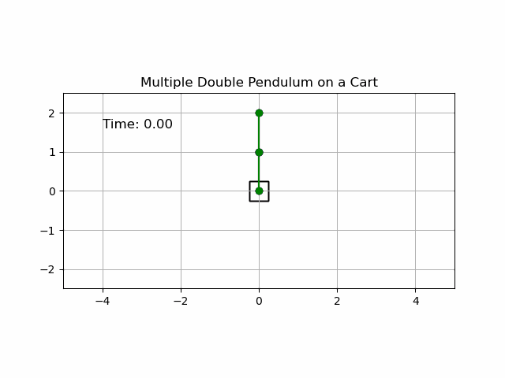

# FRTN70 - Project in Systems, Control and Learning!

This is a project in course FRTN70 at LTH, 2021.


Project is conducted by `Cem Alptürk` and `Pukashawar Pannu`.

## Goal - Balance Inverted Double Pendulum on Cart
The goal of the project is to teach a controller to balance an inverted double pendulum on a cart using reinforcement learning.
This is chaotic problem and the controller is limited to a single degree of freedom for balancing the pendulums.

<center></center>


<center><i>4 double pendulums simulated with very small differences in initial conditions.</i></center>

## Get Started
Project has been developed using `Python 3`.
Dependencies can be installed using `pip`:

```bash
# Tensorflow 2.0 requires a pip version > 19.0
pip3 install --upgrade pip
pip3 install -r src/requirements.txt
```

## TODO - Short description about reinforcement learning?

### Code Structure
The code has been separated in modules to simplify separation of logic.
`Environment` module contains everything related to the dynamic problem with the pendulum equations and a class structure that pans a way to apply an action to the system from the outside and also a way to receive a reward from the executed action.

Code in the `Agents` module contain the algorithms for training a controller using reinforcement learning.l
There are (TODO: Will be hopefully) a couple of different algorithms for training.
The idea is that a trained algorithm produces a finished controller that can be applied and used directly on the dynamic system.

```python
# TODO: Add a short example for how to use an agent
```

Code for training a controller for the double pendulum on a cart problem is found in `src/`.
With all dependencies installed it should be enough to run the `src/Training_Double_Pendulum.py` script.
The script produces training statistics and a trained controller that can be used to simulate a new pendulum scenario with the controller.


### Initial Instructions
Make sure that it is very easy to understand how to both compile and get the source code to run on your platform, including complete setup and build instructions of dependencies, such as openCV. These instructions are preferably written in the README file in the root folder of the project, using markdown. Include a picture and a short description of your finished project in this file as well).

It is not possible to commit empty folders to git. If you still want to commit an empty folder, a quite common technique to add files called .gitkeep in the empty folders.

Try to keep your git-repository clean. As a rule-of-thumb, do not check in files that can be generated from the code in the repository, e.g., compiled binaries. In principle, neither pdf-files which are generated from the TeX-code should be checked in. However, do check in final versions of your reports, presentations and all other documentation - these are the same documents that go into the shared git repo.

To help you to avoid checking in files that are not needed, the .gitignore contains rules for which files that will not be added to git by default. If you explicitly add a specific file, it will be added regardless of the rules in the .gitignore file.
